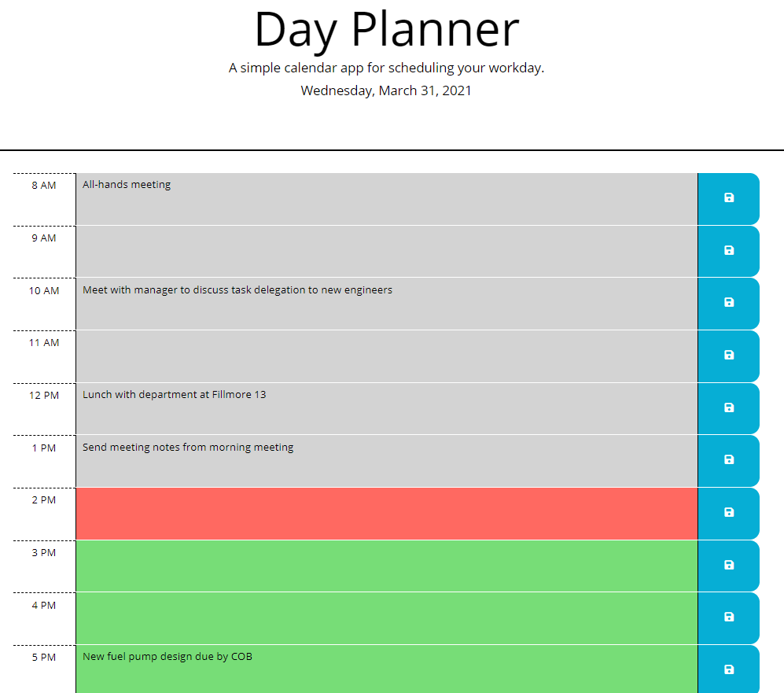

# workday-planner

## Summary 
This application uses the Moment.js library to pull the current date and time; the date is displayed at the top of the calendar, and the time is used to color-code the planner's time slots as past, present, and future. When the user enters text into a time slot and clicks the corresponding save button, the text is saved in local storage and will persist upon page re-load.

This app runs in a browser and uses jQuery to dynamically update the HTML and CSS.

## Installation
To download this code to your own machine, enter the following in your command line:

`git clone https://github.com/EmilyAH-01/workday-planner.git`

## Usage
Navigate into your cloned project directory and open index.html in a browser. Click in the colored region of a timeslot, type in your to-do list for that timeslot, and click the save button to the right to save your entry in local storage. 

## Deployed Application
https://emilyah-01.github.io/workday-planner/

## Future Development
1. Add a "clear all" button to clear the previous day's entries.
2. Add the ability for a user to customize the number of timeslots, so the workday can start and end at different times or have half-hour increments.

## Credit
The CSS and HTML starter code for this application was provided by MSU Coding Bootcamp.
